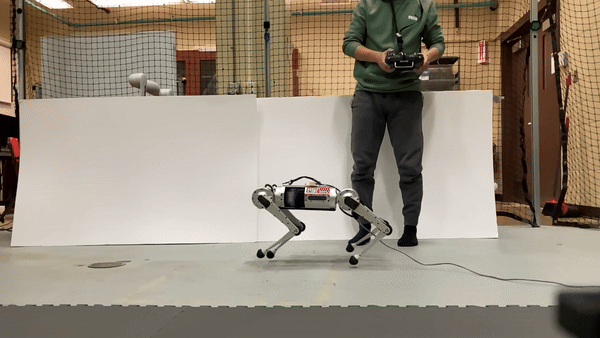

## **What CAFE-MPC Can Do**
   

## **Dependency**
This implementation uses [Eigen](https://gitlab.com/libeigen/eigen) for linear algegra, [Pinocchio](git@github.com:stack-of-tasks/pinocchio.git) for analytical derivatives, [LCM](https://github.com/lcm-proj/lcm/releases) for communications to low-level controllers, and [boost](https://www.boost.org/users/history/) for reading configuration files. A customized **Hybrid-Systems DDP (HS-DDP)** solver is employed to solve the nonlinear trajectory optimization problem. 

### **Installation instructions for the third-party libraries**

```
VERY IMPORTANT: you MUST install Pinocchio version 2.6.10 for this to work!
```
- [Pinocchio 2.6.10](git@github.com:stack-of-tasks/pinocchio.git): Folow the instructions [here](https://stack-of-tasks.github.io/pinocchio/download.html) to install Pinocchio via robotpkg. As a reminder, do NOT forget configuring the environment variables, so that CMake can find Pinocchio while building.
- [LCM1.4.0](https://github.com/lcm-proj/lcm/releases/tag/v1.4.0), [Boost1.71](https://www.boost.org/users/history/)
    ```
        ./scripts/install_dependencies.sh
    ```


- Note: By default, Pinocchio2 would install Eigen3.3. 


## **Build CAFE-MPC**

Once Eigen and LCM are successfully installed, generate necessary lcm types

```bash
cd scripts
./make_types.sh
```

To build the MPC controller

```bash
mkdir build && cd build
cmake ..
make -j4
```

So far, you have built the CAFE-MPC controller. It has to function with a simulator and a whole-body controller.

## **Simulation and Value-Based Whole-Body Controller**
We use Cheetah-Software for dynamics simulation. The Value-Based Whole-body controller is implemented in Cheetah-Software as well. To buld Cheetah-Software, you need to install dependencies with the following script

```
./install_dependencies_cheetah_software.sh
```
Clone the Cheetah-Software repo:
```
cd ..
git clone -b -b cafempc_low_level https://github.com/heli-sudoo/Cheetah-Software-He.git Cheetah-Software
```
Build Cheetah-Software:
```
cd Cheetah-Software/scripts
./make_types.sh
cd .. 
mkdir build && cd build
cmake ..
make -j4
```

## **Run Simulator, VWBC, CAFE-MPC**
Open three terminals, one for simulation, one for low-level VWBC, and one for CAFE-MPC. 

In the **first terminal** 
```
cd Cheetah-Software/build
sim/sim
```
This opens two windows, one for simulation, the other one is a control panel.

In the **second terminal**,
```
user/MHPC_LLController/mhpc_llctrl m s
```
You will see the robot moves its legs to a zero configuration and stand up.

In the **third terminal**,
```bash
cd CAFE-MPC/build
MHPC/mhpc_run
```
In the control panel, switch the `contrl_mode` to 2. You will see the robot starts performing locomotion.

---
## **Barrel Roll**
In order to run a barrel roll simulation on Ubuntu 20.04, you first need to increase the default UDP buffer size:
```
sudo sysctl -w net.core.rmem_max=26214400
sudo sysctl -w net.core.rmem_default=26214400
```

Then run the following:

In the **first terminal** 
```bash
cd CAFE-MPC/Cheetah-Software/build
sim/sim
```
This opens two windows, one for simulation, the other one is a control panel.

In the **second terminal**,
```bash
cd CAFE-MPC/Cheetah-Software/build
user/MHPC_LLController/mhpc_llctrl m s
```
You will see the robot moves its legs to a zero configuration and stand up.

In the **third terminal**,
```bash
cd CAFE-MPC/build
MHPC/mhpc_run
```
In the control panel, set the following:
```
use_rc = 0
contrl_mode = 2
```
You will see the robot starts performing an in-place barrel roll.


---
## **Any Reference Trajectory**
In order to run any reference trajectory simulation on Ubuntu 20.04, you first need to increase the default UDP buffer size:
```
sudo sysctl -w net.core.rmem_max=26214400
sudo sysctl -w net.core.rmem_default=26214400
```

Change the line in `CAFE-MPC/MHPC/MHPCLocomotion.cpp` (`quad_reference_file.append(mpc_config.referenceFileName);`) into (`quad_reference_file.append("your_file");`) with `your_file = pace_br_pace/01_jump_forward` for example. 

Build the software again:
```
cd CAFE-MPC/build
cmake ..
make -j4
```

Then run the following:

In the **first terminal** 
```bash
cd CAFE-MPC/Cheetah-Software/build
sim/sim
```
This opens two windows, one for simulation, the other one is a control panel.

In the **second terminal**,
```bash
cd CAFE-MPC/Cheetah-Software/build
user/MHPC_LLController/mhpc_llctrl m s
```
You will see the robot moves its legs to a zero configuration and stand up.

In the **third terminal**,
```bash
cd CAFE-MPC/build
MHPC/mhpc_run
```
In the control panel, set the following:
```
use_rc = 0
contrl_mode = 2
```
You will see the robot starts performing the reference trajectory.

---
## Generate Reference Trajectories

### Problems
First I had to state the path to `lcmtypes` so that python could find it. So at the start of the file in `scripts/References_python/gen_*`, include:
```
import sys
sys.path.append('/YOUR_OWN_PATH_TO_REPO/CAFE-MPC/')
```

Then, I had to install py_bullet with:
```
sudo pip3 install pybullet
```

Had a bunch of dependancy problems (couldn't find lcm), the solution was to run:
```
cd /YOUR_OWN_PATH_TO_REPO/CAFE-MPC/scripts/external/lcm-1.4.0/lcm-python
sudo python3 setup.py install
```

Next, I had to change the urdf_filename variable to an absolute path in `scripts/References_python/gen_*`:
```
urdf_filename =  "/YOUR_OWN_PATH_TO_REPO/CAFE-MPC/urdf/mini_cheetah_simple_correctedInertia.urdf"
```

I had to make the `data` folder in `scripts/Reference_python`:
```
cd /YOUR_OWN_PATH_TO_REPO/CAFE-MPC/scripts/References_python
mkdir data
```

And in `scripts/References_python/utils.py`, I changed the local path to a global one in the function 'write_traj_to_file`, for example:
```
np.savetxt("/YOUR_OWN_PATH_TO_REPO/CAFE-MPC/scripts/Reference_python/data/time.csv", np.asarray(time), delimiter=",", fmt='%8.4f')
```

Commented this line in `scripts/References_python/gen_*`:
```
# utils.publish_trajectory_lcm(time, pos_tau, eul_tau, vel_tau, eulrate_tau, 
                            #  jnt_tau, jntvel_tau, contact_tau)
```
